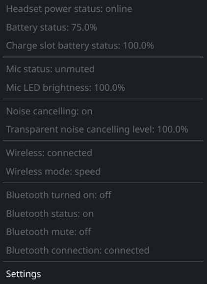
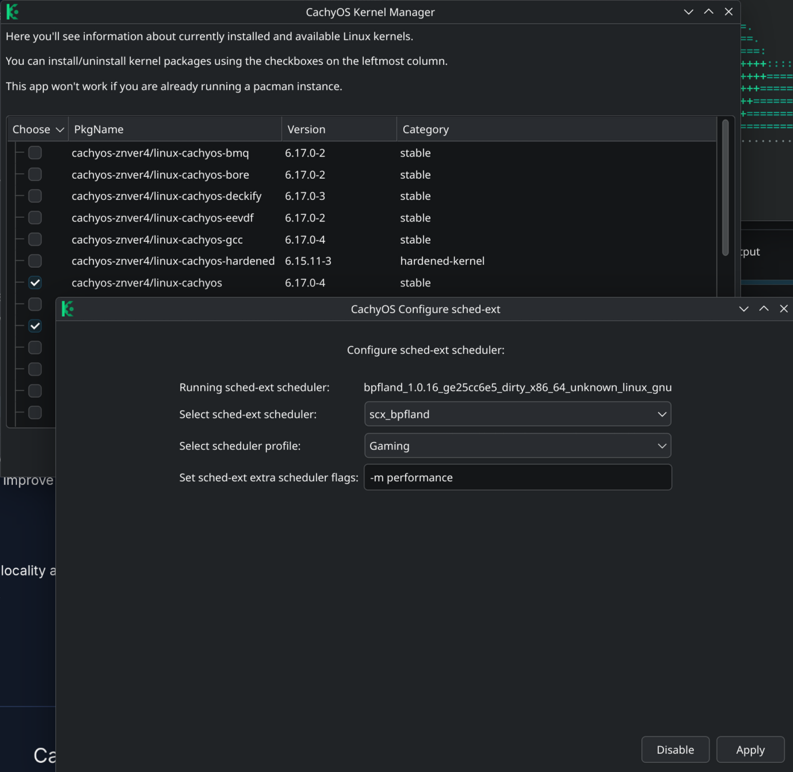

# CachyOS Install
This is meant to collect my notes as I try to move on from Windows on my gaming PC. 

<ins>A few handy links:</ins>
- [CachyOS Wiki](https://wiki.cachyos.org/)
- [CachyOS Forum](https://discuss.cachyos.org/)
- [Linux Gaming Subreddit FAQ](https://www.reddit.com/r/linux_gaming/wiki/faq/)

## Fresh Install

My PC has two M.2 SSD's, one with windows 11 and one with CachyOS. For the install I used the following options:

**Boot Manager**

I went with **rEFInd** because I don't need BIOS support and wanted something customizable.

**Filesystem**

I went with the default **BTRFS** because it includes snapshot functionality and several other [features](https://itsfoss.com/btrfs/)

**Desktop Environment**

**KDE Plasma** Straight forward and supports Wayland.

## Customization

**BTRFS Assistant**

I installed this first so that I could create a snapshot of a fresh install in case I needed to roll back to it for any reason.

**Post Install Tweaks**

I used the [wiki](https://wiki.cachyos.org/configuration/post_install_setup/) guide to apply other tweaks that it recommended. The WiFi region didn't work because my onboard WiFi & Bluetooth adapter [doesn't have a working linux driver](https://www.reddit.com/r/homelab/comments/1iw23f3/anybody_know_if_mediatek_tp_link_7927_wifi_7_is/).

**Secure Boot Setup**

This is required so that CachyOS plays nicely with my Windows 11 install. [The Wiki provides a good walkthrough.](https://wiki.cachyos.org/configuration/secure_boot_setup/) 

**Boot Manager Config**

rEFInd is pretty easy to modify, it autodetects OS installs. I went with the [refind-theme-regular](https://github.com/bobafetthotmail/refind-theme-regular) but other themes can be found [here](https://refind-themes-collection.netlify.app/). The only settings I had to change was to set the resolution to max and to rename the OS icons so that the correct ones were used.

**Peripheral Setup**

<ins>Mouse - Razer Cobra Pro</ins> - For this I installed the [OpenRazer drivers](https://openrazer.github.io/) and the Polychromatic GUI. As of 5-Oct-25, OpenRazer does not support the charging dock.

<ins>Keyboard - Keychron Q5 Max</ins> - No software required for my keyboard, it is programmed through a web interface called [Launcher](launcher.keychron.com). Can't seem to get launcher to work using chromium, might have to program using Windows partition. It's not necessary to do it very often so not a big deal.

<ins>Headset - Steelseries Nova Pro Wireless</ins> - This one was a bit more of a challenge. Steelseries has the GG software on Windows which works well and does a good job controlling audio channels. I found [Linux Arctis Manager](https://github.com/elegos/Linux-Arctis-Manager) which at least has an AUR for Arch. It can be found with Octopi using the paru tool. The AUR doesn't start the daemon however so I had to first enable the service manually using `systemctl --user enable arctis-manager.service` followed up with `arctis-manager` to start the program. Doing this will cause it to launch automatically on restart.

<ins> Bluetooth - TPLink BT500</ins>

## Gaming Setup
**Kernel and Scheduler**

No real change necessary other than setting the scheduler to the gaming preset.

**KDE Settings**

[System settings from this video](https://youtu.be/Vg7uclIuETQ?t=890)

**Steam Settings**

[Steam settings from this video](https://youtu.be/Vg7uclIuETQ?t=1495)

## App Install
